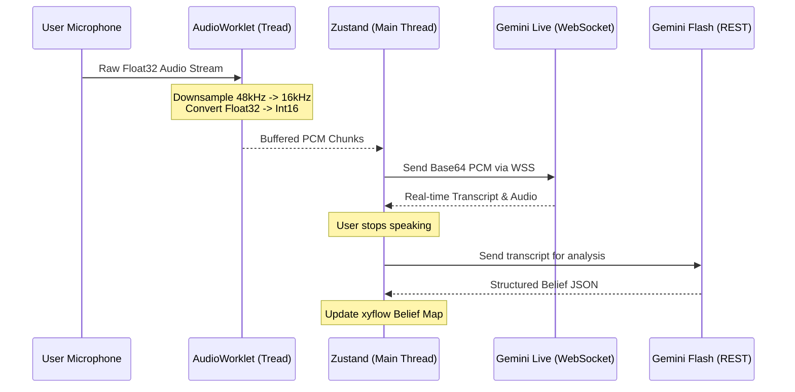
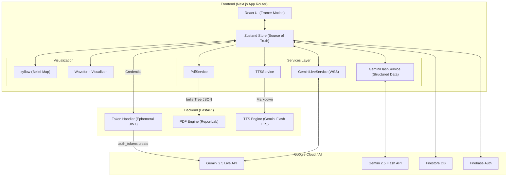

# MindRoots

**MindRoots** is an interactive, voice-driven web application powered by **Google's Gemini 2.5 Flash Native Audio Preview** and the new Gemini Multimodal Live API. It leverages advanced conversational AI to act as a responsive, real-time agent that can see, hear, and speak with users, dynamically maintaining affective dialog and providing mental frameworks/belief trees.

## 🚀 Features & Functionality

*   **Real-time Multimodal Interaction:** Uses WebSockets to connect directly to the Gemini Live API, streaming audio from the user's microphone and playing back Gemini's spoken audio responses seamlessly.
*   **Affective Dialog & Dynamic Configurations:** An Admin panel allows operators to dynamically update the agent's behavior, voice ("Puck", "Aoede", etc.), temperature, and System Instructions *while the app is running*.
*   **Secure Ephemeral Tokens:** The Next.js frontend connects to a Python FastAPI backend to securely request short-lived ephemeral tokens via the `@google/genai` SDK, ensuring API keys are never exposed to the client browser.
*   **User Authentication & Data Persistence:** Integrated with Firebase Authentication (Google Sign-in) and Cloud Firestore to track user state, generated "Belief Trees", and session data.
*   **Nano Banana Integration:** Utilizes Gemini image generation models to dynamically create visual metaphors based on conversation context.

## 🏗️ Architecture (Technical Deep-Dive v3.0)

This section provides a granular look at the specialized pipelines and service interactions that enable MindRoots' low-latency, multimodal AI experience.

### 🎙️ Real-Time Audio & AI Pipeline

MindRoots utilizes a specialized Web Audio pipeline to meet the strict requirements of the Gemini Multimodal Live API (16-bit Mono PCM @ 16kHz).



### 🏗️ Component Interaction Map

A detailed view of how the various frontend services and backend endpoints collaborate.



### 🔐 Authentication & Token Delegation

To keep API keys away from the client while maintaining direct low-latency connections, MindRoots uses an ephemeral token strategy.

1.  **Client Request:** React sends a request to `/api/token` with user credentials.
2.  **Validation:** FastAPI verifies the session.
3.  **Delegation:** Backend calls Google Vertex/AI Studio `auth_tokens.create` with a 30-minute expiry.
4.  **Connection:** Frontend uses the short-lived token to establish a direct WSS connection to Google's edge.

### 📄 PDF Generation Engine (ReportLab)

Unlike simple HTML-to-PDF tools, MindRoots uses a custom server-side drawing engine for premium typography.
- **Header:** Injected system branding and session metadata.
- **Style Definition:** High-contrast dark mode style sheets for multi-line JSON beliefs.
- **Belief Cards:** Uses `KeepTogether` flowables to ensure belief origins aren't split across pages.
- **Background:** Canvas-level drawing of watermarks and gradient borders.

## 🛠️ Technologies Used

*   **Frontend:** Next.js (App Router), React 18, Tailwind CSS, Zustand (State Management), Framer Motion (Animations).
*   **Audio Processing:** Web Audio API, Custom `AudioWorkletProcessor` (PCM 16-bit 16kHz audio formatting required by Gemini), and `AudioContext` scheduling for low-latency playback.
*   **Backend:** Python 3, FastAPI, Uvicorn.
*   **Google AI:** Google GenAI SDK (`@google/genai` / `google-genai`), `gemini-2.5-flash-native-audio-preview-12-2025` model.
*   **Google Cloud:** Firebase Authentication, Cloud Firestore.
*   **Infrastructure / Deployment:** Automated via multi-stage Dockerfiles (`Dockerfile` and `backend/Dockerfile`).

## 🧠 Findings and Learnings

During the development of MindRoots, several key learnings emerged:
1.  **Audio Formatting is Critical:** The Gemini Multimodal Live API strictly expects 16-bit PCM audio at 16kHz. Implementing an `AudioWorkletProcessor` on the frontend was crucial to downsample and convert the raw microphone input efficiently without blocking the main thread.
2.  **Ephemeral Tokens Enhance Security:** Transitioning from long-lived API keys on the client to requesting 30-minute ephemeral tokens from the Python backend significantly improved the security posture without sacrificing the low latency of the direct WebSocket connection to Google's edges.
3.  **State Management in Streaming Environments:** Handling real-time interruptions, dynamic Voice Activity Detection (VAD) configurations, and synchronized UI state (like audio visualizers) concurrently required robust state management techniques using Zustand to prevent race conditions.

---

## 💻 Spin-up Instructions (How to run locally)

MindRoots is designed to be fully reproducible with a single script that cleanly starts both the Python backend and the Next.js frontend.

### Prerequisites
*   [Node.js](https://nodejs.org/) (v20+ recommended)
*   [Python](https://www.python.org/) (3.10+ recommended)
*   A `GEMINI_API_KEY` (Get one from [Google AI Studio](https://aistudio.google.com/))

### 1. Environment Setup

**Backend (.env):**
Create a `.env` file inside the `backend/` directory:
```env
GEMINI_API_KEY=your_gemini_api_key_here
ADMIN_SECRET=mindroots-admin-2025
```

**Frontend (.env.local):**
Depending on your Firebase setup, create a `.env.local` in the root directory with your Firebase configuration variables.

### 2. Install Dependencies

**Frontend:**
```bash
npm install
```

**Backend:**
```bash
cd backend
python -m venv .venv

# On Windows:
.\.venv\Scripts\Activate.ps1
# On Mac/Linux:
# source .venv/bin/activate

pip install -r requirements.txt
cd ..
```

### 3. Run the Application

For a clean, single-command startup (Windows PowerShell):
```powershell
.\start.ps1
```
*(This script will kill old orphan ports, clear Next.js/Python caches, and boot both the FastAPI server on port 8000 and the Next.js frontend on port 3000.)*

### 4. Access the App
*   **Main Application:** `http://localhost:3000`
*   **Admin Dashboard:** `http://localhost:3000/admin`
*   **Backend API Docs:** `http://localhost:8000/docs`

## ☁️ Cloud Deployment Automation (IaC)

This repository includes Infrastructure-as-Code configurations to automate cloud deployment:
1.  **Root `Dockerfile`:** A multi-stage Docker build process optimized to compile and serve the standalone Next.js frontend.
2.  **Backend `backend/Dockerfile`:** Automates the Python environment setup and uvicorn server execution for the FastAPI service.
3.  **Firebase Configs:** `firebase.json` and `firestore.rules` define deployed cloud database structures and security rules.

